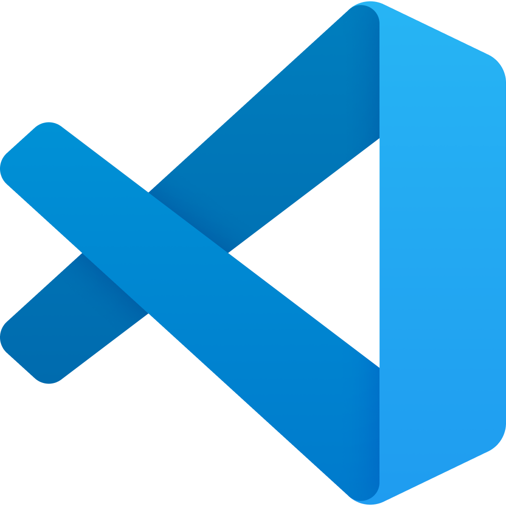
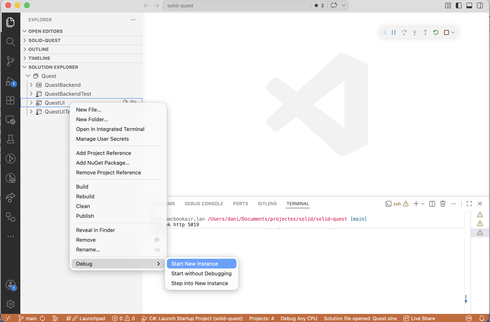

# Entorn de treball

L'entorn de treball proposat és dotnet SDK + VS Code + compte a GitHub (per les live-sessions)

En aquest document poso enllaços i comentaris de com fer instal·lació

També s'explica com crear entorn al portàtil gestionat pel departament sense permisos d'administrador.


---

## Github

Seria interessant disposar d'un compte de [github](https://github.com/) per poder fer live share


---

## Dotnet SDK (amb permisos admin)

* Navega fins a [Download .NET](https://dotnet.microsoft.com/en-us/download) i baixa't l'instal·lador de la versió 10 (LTS = Long Term Service)
* Instal·la usant l'instal·lador.
  
---

## Dotnet SDK (sesne permisos admin amb instal·lador MS)


[dotnet-install scripts reference](https://learn.microsoft.com/en-us/dotnet/core/tools/dotnet-install-script)

```powershell
Invoke-WebRequest https://dot.net/v1/dotnet-install.ps1 -OutFile dotnet-install.ps1
.\dotnet-install.ps1 -Channel STS
```

Posar-lo al path (cal reiniciar després la powershell)

```powershell
[Environment]::SetEnvironmentVariable(
    "PATH",
    $env:PATH + ";$env:LOCALAPPDATA\Microsoft\dotnet",
    "User"
)
```

---
## Visual Studio Code (amb permisos admin)

* Jo faré servir [Visual Studio Code](https://code.visualstudio.com/) per a totes les pràctiques. Si algú està més comode amb altres IDEs endavant.
* [Descarrega't l'instal·lador](https://code.visualstudio.com/download) i instal·la



---
## Visual Studio Code (sense permisos admin)

* A la [pàgina de descàrreges](https://code.visualstudio.com/download) descarrega't el zip.
* Desenzipa i canvia el nom a `vscode` a la carpeta que has desenzipat.
* Mou la carpeta a la teva carpeta de perfil. T'ha de quedar quelcom semblant a `c:\users\dherrera\vscode`
* Afegeix la carpeta al path: ``[Environment]::SetEnvironmentVariable("PATH", $env:PATH + ";$env:USERPROFILE\vscode", "User")`
* Opcionalment, crea una drecera al teu escriptori i/o a la barra de tasques.

---
# Extensions de Visual Studio Code

Afegeix les següents extensions al teu VS Code:

  * [Extensió C# Dev KitName: C#](https://marketplace.visualstudio.com/items?itemName=ms-dotnettools.csdevkit)
  * [Base language support for C#](https://marketplace.visualstudio.com/items?itemName=ms-dotnettools.csharp)
  * [Live Share](https://marketplace.visualstudio.com/items?itemName=MS-vsliveshare.vsliveshare)

---
# Anem a comprovar que tots tenim el VS Code

Dues mini pràctiques.

* Programam mínim "Hello World" des de plantilla.
* Prova de Live Share

---
## Hello world
### Crear projecte

* Obra la shell de la teva màquina.
* Posa't en una carpeta de treball, exemple `cd Documents`.
* Executa:

```bash
dotnet new console -o ElMeuHelloWorld
```

* Obra amb VS Code:

```bash
code ElMeuHelloWorld
```

---
## Hello world
### Executar I

* Executem des de línia de comandes.

* Obrim el terminal del VS Code:

```bash
dotnet run
```

---
## Hello world
### Executar II

Executem des de VS Code



---
## Hello world
### Crear projecte II

* Esborra el projecte anterior.
* Obra la shell de la teva màquina.
* Posa't en una carpeta de treball, exemple `cd Documents`.
* Executa:

```bash
dotnet new console -o ElMeuHelloWorld --use-program-main
```

* Obra amb VS Code:

```bash
code ElMeuHelloWorld
```

---
## Hello world
### Live Share experience

Durant el curs potser algú voldrà col·laborar amb les sessions de codi que farem.
Això serà positiu perquè obrirà més debat i farà que el curs sigui més participatiu i fresc.
Anem a fer un simulacre on ens connectem tots al meu codi.