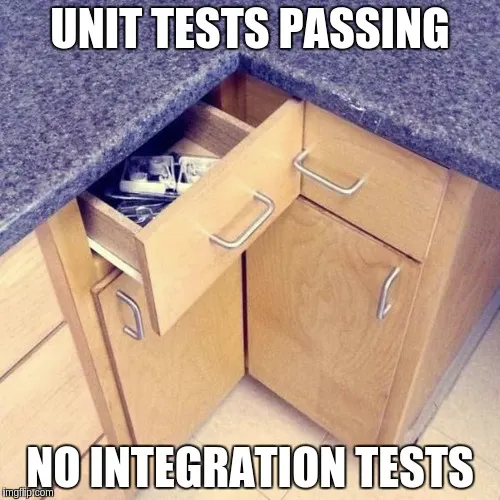

# Testing
## Què és un test

Un test codi de programació que comprovarà que alguna funcionalitat del nostre programa funciona com esperem.

```c#
[Fact]
public void IsPrime_InputIs1_ReturnFalse()
{
    var primeService = new PrimeService();
    bool result = primeService.IsPrime(1);

    Assert.False(result, "1 shouldn't be prime");
}
```
---

## Per què necessitem testos

Hi ha diferents arguments a favor dels tests. Aquests són alguns dels més rellevants:

- Cada cop que fem canvis al programa és fàcil introduir errors, no volem tornar a provar a mà tot el que s'hagi pogut espatllar, soms informàtics, ho automatitzem.
- Els testos ens ajuden a construir el programa (TDD)
- Canvis de versions a les llibreries: Quan actualitzem dependències externes cal comprovar que tot segueix funcionant, no ho volem fer a mà.
- Refactor: volem millorar el codi **sense por** a haver fet errors en aquests canvis.

---

## Quina fila fa un test

Els tests es divideixen en tres parts:

1. Preparem els objectes i valors que necessitem per fer el test.
2. Executem el codi que volem provar
3. Mirem si els resultats son els esperats.

Aquestes parts reben el nom de:

* Given / When / Then
* Arrange / Act / Assert

---

## Què testem I

* Fem els testos que facin que poguem confiar en la nostra aplicació.
* Testos unitaris:
  * Són ràpids
  * Testes funcions o classes de la nostra aplicació de manera aïllada.
* Testos d'acceptació
  * Testos que normalment prepara/redacta el departament de QA i que caldrà passar per considerar la funcionalitat finalitzada.

---

## Què testem I

* Testos d'integració
  * Solen ser més lents
  * Testen diferents capes de la nostre aplicació
* Testos E2E
  * Impliquen base de dades. Normalment es munten containers de test.
  * Testen funcionalitats senceres de la nostra aplicació des de la UI fins la BD.



---


## Quina seria la cobertura ideal per un projecte?

* Cobertura alta NO implica qualitat alta.
* Cobertura extremadament baixa acostuma a indicar risc.
* E2E mínims però crítics
* El codi crític ha d’estar molt cobert
* El coverage és un efecte secundari del bon desenvolupament

---


## Què és TDD

* El TDD és el desenvolupament guiat per testos.
* Es basa en tres fases:
  * Escrivim el test, el que ha de succeir, el test falla perquè allò no està implementat.
  * Implementem per a que passi el test.
  * Refactoritzem per a que quedi llegible i si cal optimitzem.
* Escriu tests per conduir disseny no per perseguir percentatges
* https://kentbeck.com/

---


## Per què necessitem testos en aquest curs

> “Make it work, make it right, make it fast” 
> _Kent Beck_

No fem els programes de cop, els fem de mica en mica aproximant-nos a la solució final. Ens cal saber que el que hem fet funciona i ens cal garantir que segueix funcionant quan refactoritzem el programa per, per exemple, fer que compleixi amb els principis SOLID.

